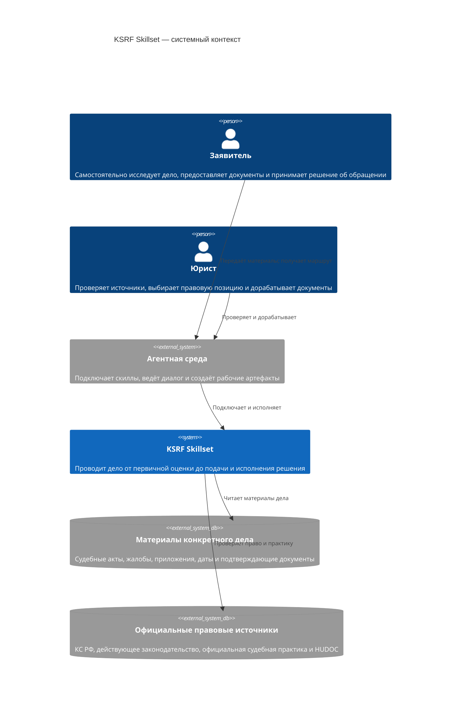
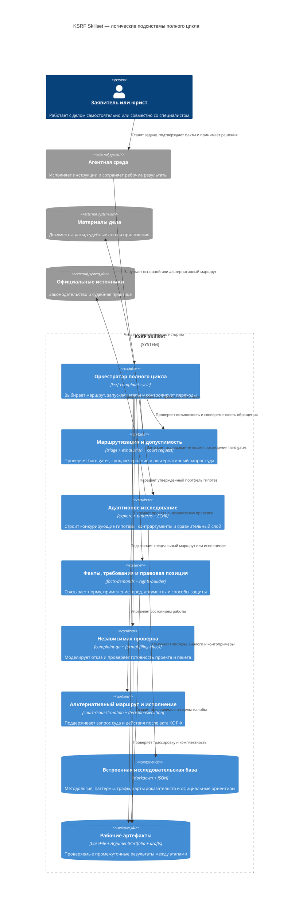
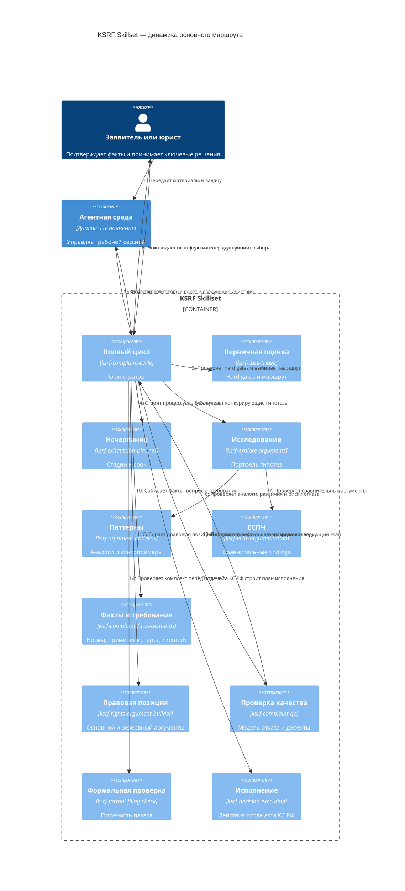
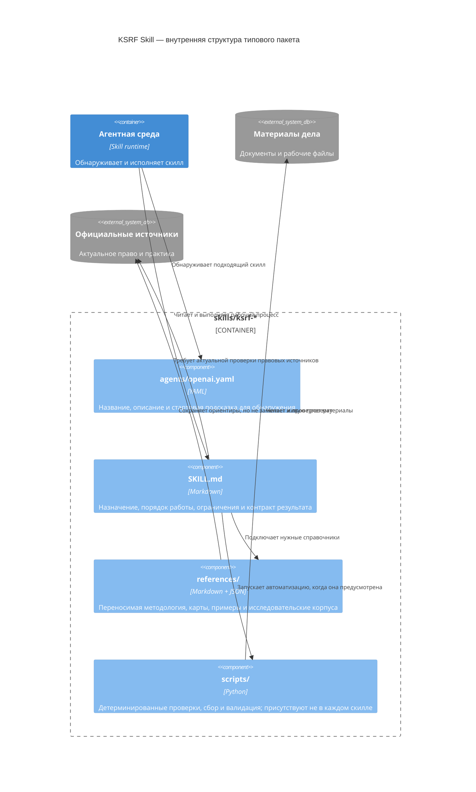
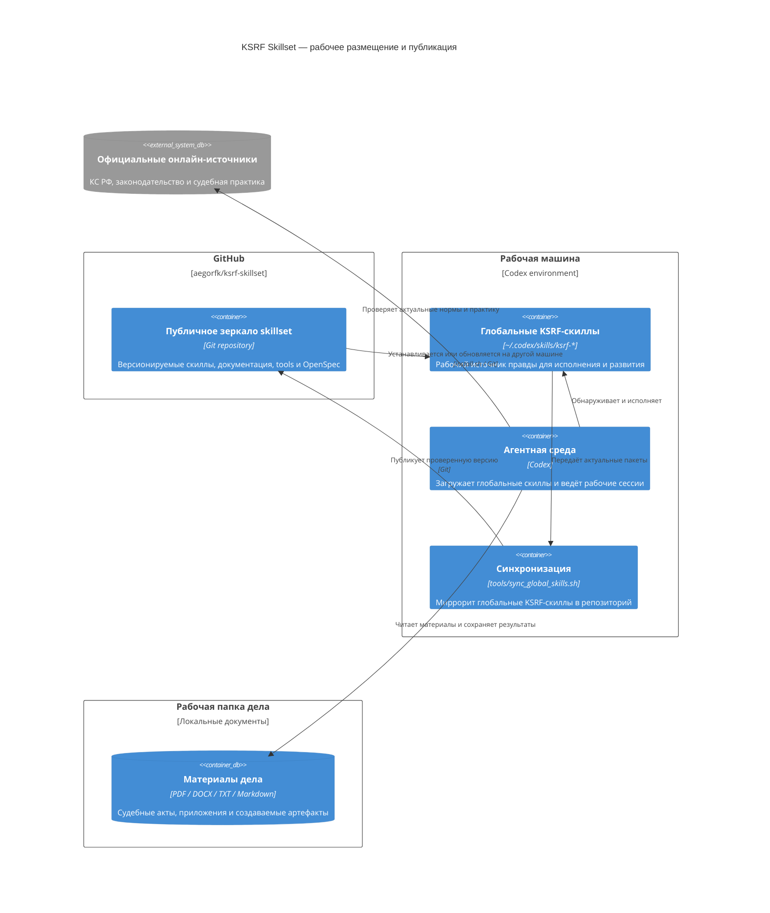

# Карта архитектуры KSRF-скиллов в нотации C4

> Черновик для обсуждения. Файл создан локально и пока не предназначен для коммита.

Эта карта показывает один и тот же набор скиллов на нескольких уровнях абстракции. Поскольку KSRF-скиллы являются пакетами инструкций, справочников и скриптов, а не отдельными сетевыми сервисами, уровень контейнеров ниже используется как **логическое разбиение на функциональные подсистемы**.

| Представление | На какой вопрос отвечает |
| --- | --- |
| Уровень 1 — System Context | кто использует набор и с какими внешними источниками он работает |
| Уровень 2 — Containers | на какие крупные функциональные подсистемы распадается полный цикл |
| Уровень 3 — Components | как связаны все 12 KSRF-скиллов |
| Dynamic | как проходит типовой маршрут подготовки жалобы |
| Implementation и Deployment | из чего состоит пакет скилла и как skillset публикуется и исполняется |

## Уровень 1. System Context

### Что видно на этом уровне

- skillset не заменяет заявителя или юриста, а организует и усиливает их работу;
- материалы дела и официальные источники остаются внешними источниками истины;
- агентная среда отвечает за диалог и исполнение, а KSRF Skillset — за специализированную методологию.

## Уровень 2. Containers — функциональные подсистемы

### Ключевая архитектурная граница

Процесс разделён на две части:

1. **Жёсткая процессуальная оболочка** — допустимость, применение нормы, конкретное дело, исчерпание, срок и источники.
2. **Адаптивное исследование** — конкурирующие объяснения дефекта нормы, альтернативные тесты, контраргументы и способы устранения проблемы.

Сильная содержательная гипотеза не компенсирует провал обязательного процессуального условия.

## Уровень 3. Components — карта 12 скиллов

```mermaid
C4Component
title KSRF Skillset — взаимодействие скиллов

Container(agent, "Агентная среда", "Codex / совместимый агент", "Подключает скиллы и ведёт рабочую сессию")
SystemDb_Ext(casefiles, "Материалы дела", "Факты, документы и судебная история")
SystemDb_Ext(official, "Официальные источники", "Нормы и судебная практика")
ContainerDb_Ext(corpus, "Встроенный корпус", "Markdown + JSON", "Паттерны, карты, графы и исследовательские справочники")

Container_Boundary(skillset, "KSRF Skillset") {
  Component(cycle, "Полный цикл жалобы", "ksrf-complaint-cycle", "Оркестрирует маршрут и переходы между этапами")
  Component(triage, "Первичная оценка", "ksrf-case-triage", "Отделяет hard gates от содержательных гипотез")
  Component(exhaustion, "Исчерпание и срок", "ksrf-exhaustion-planner", "Строит процессуальный маршрут и проверяет готовность")
  Component(motion, "Запрос обычного суда", "ksrf-court-request-motion", "Готовит альтернативный маршрут до завершения дела")
  Component(explore, "Исследование аргументов", "ksrf-explore-arguments", "Сравнивает principal, reserve, experimental и rejected hypotheses")
  Component(patterns, "Библиотека аргументативных паттернов", "ksrf-argument-patterns", "Даёт аналогии, различия, контрпримеры и формулы")
  Component(echr, "Сравнительный слой ЕСПЧ", "ksrf-echr-argumentation", "Проверяет позитивные обязательства, proportionality и effective remedy")
  Component(facts, "Факты и требования", "ksrf-complaint-facts-demands", "Связывает норму, применение, вред, вопрос и просительную часть")
  Component(rights, "Правовая позиция", "ksrf-rights-argument-builder", "Превращает утверждённый портфель в проверяемую аргументацию")
  Component(qa, "Проверка качества", "ksrf-complaint-qa", "Моделирует отказ и проверяет трассировку и устойчивость")
  Component(formal, "Формальная готовность", "ksrf-formal-filing-check", "Проверяет реквизиты, приложения, полномочия и канал подачи")
  Component(execution, "Исполнение решения", "ksrf-decision-execution", "Планирует пересмотр, компенсацию и нормативное исполнение")
}

Rel_D(agent, cycle, "Запускает")
Rel_D(cycle, triage, "Определяет готовность")
Rel_D(triage, exhaustion, "Передаёт CaseFile и hard gates")
Rel_R(exhaustion, motion, "Открывает альтернативный маршрут")
Rel_D(exhaustion, explore, "Разрешает исследование")
Rel_R(explore, patterns, "Запрашивает аналоги и контрпримеры")
Rel_L(explore, echr, "Запрашивает сравнительный слой")
Rel_D(explore, facts, "Передаёт ArgumentPortfolio")
Rel_D(facts, rights, "Передаёт норму, применение, вред и remedy")
Rel_D(rights, qa, "Передаёт проект аргументации")
Rel_D(qa, formal, "Разрешает формальную комплектацию")
Rel_D(formal, execution, "Передаёт post-decision контекст")
Rel_D(casefiles, triage, "Предоставляют факты")
Rel_D(official, exhaustion, "Подтверждают правила")
Rel_D(corpus, patterns, "Предоставляет паттерны и карты")

UpdateLayoutConfig($c4ShapeInRow="4", $c4BoundaryInRow="1")
```

Стрелки показывают доминирующий поток артефактов. Управление переходами на каждом этапе остаётся у `ksrf-complaint-cycle`.

### Каталог компонентов

| Скилл | Основная ответственность | Ключевой результат |
| --- | --- | --- |
| `ksrf-complaint-cycle` | оркестрация полного цикла | согласованный маршрут и состояние работы |
| `ksrf-case-triage` | первичная допустимость и готовность | решение: исследовать, укрепить процесс, запросить материалы или остановиться |
| `ksrf-exhaustion-planner` | исчерпание, применение нормы и срок | процессуальная линия и список следующих действий |
| `ksrf-court-request-motion` | запрос суда и ходатайство стороны | квалификация маршрута и проект процессуального документа |
| `ksrf-explore-arguments` | исследование конкурирующих гипотез | `ArgumentPortfolio` с основной, резервной и отклонёнными линиями |
| `ksrf-argument-patterns` | исследовательская библиотека практики КС РФ | candidate findings, аналоги, различия и refusal risks |
| `ksrf-echr-argumentation` | проверяемый сравнительный слой ЕСПЧ | supporting/adverse findings с пределами переноса |
| `ksrf-complaint-facts-demands` | факты, конституционный вопрос и требования | фактологическая трассировка и основная/узкая формулы remedy |
| `ksrf-rights-argument-builder` | правовая позиция | проверяемые разделы основного и резервного аргументов |
| `ksrf-complaint-qa` | независимая содержательная проверка | refusal model, список дефектов и решение о готовности |
| `ksrf-formal-filing-check` | техническая и формальная подача | комплектность, реквизиты, приложения и выбранный канал |
| `ksrf-decision-execution` | последствия акта КС РФ | план пересмотра, компенсации и нормативного исполнения |

## Dynamic. Типовой маршрут жалобы

### Ответвления от основного маршрута

- если hard gate не пройден, цикл останавливается или возвращает список недостающих материалов;
- если обычное дело ещё рассматривается, может быть выбран `ksrf-court-request-motion` вместо индивидуальной жалобы;
- если исследование не подтверждает жизнеспособную позицию, проект не должен автоматически переходить к drafting;
- если QA находит некомпенсируемый дефект, формальная комплектация не делает жалобу готовой.

## Implementation. Устройство одного пакета скилла

## Deployment. Источник правды и публикация

## Архитектурные выводы

1. `ksrf-complaint-cycle` является единственной точкой оркестрации, но не концентрирует внутри себя всю методологию.
2. Исследование вынесено в отдельный контур `explore-arguments → argument-patterns / echr-argumentation`, чтобы drafting не фиксировал первую удобную гипотезу.
3. Между исследованием и составлением позиции предусмотрен ручной выбор основной и резервной линий.
4. `complaint-qa` и `formal-filing-check` решают разные задачи: первый проверяет юридическую устойчивость, второй — техническую готовность пакета.
5. `court-request-motion` образует альтернативный процессуальный маршрут, а `decision-execution` продлевает жизненный цикл за пределы подачи жалобы.
6. Встроенные references обеспечивают автономность, но актуальные нормы и факты конкретного дела всегда требуют проверки по первичным источникам.
